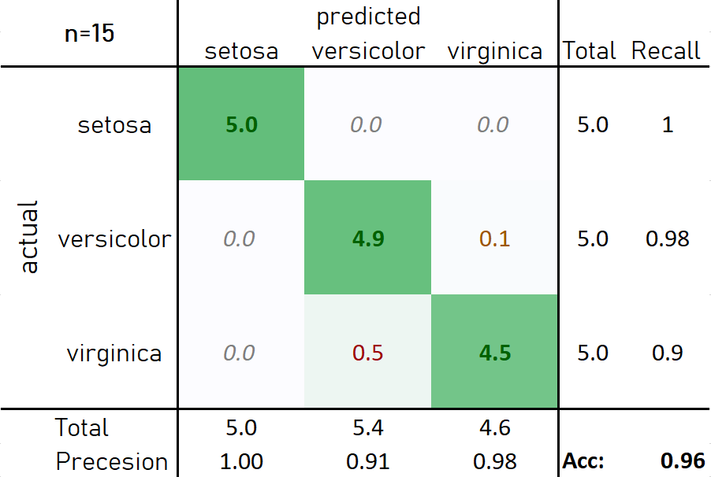
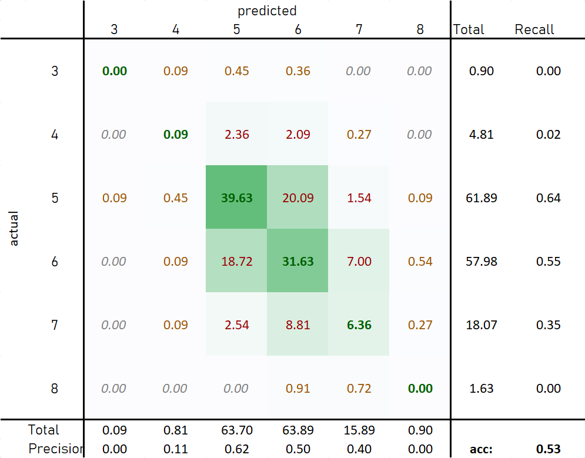
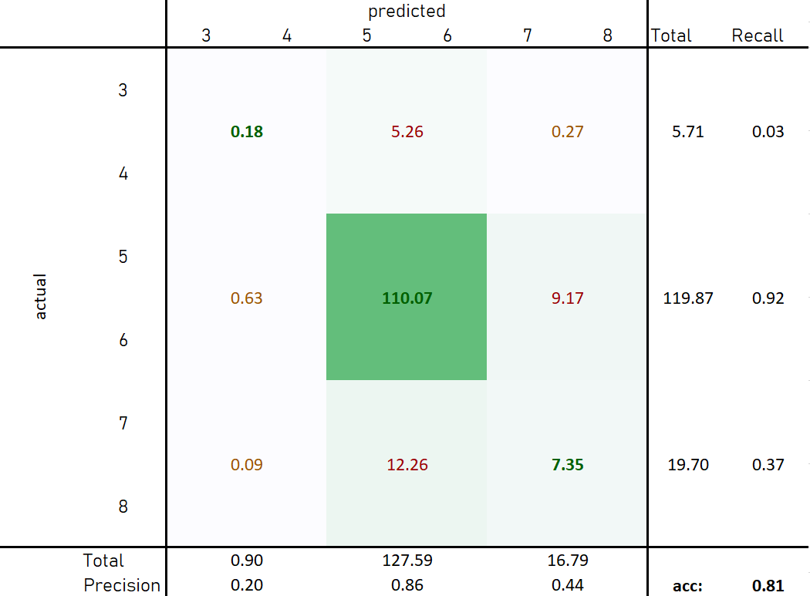
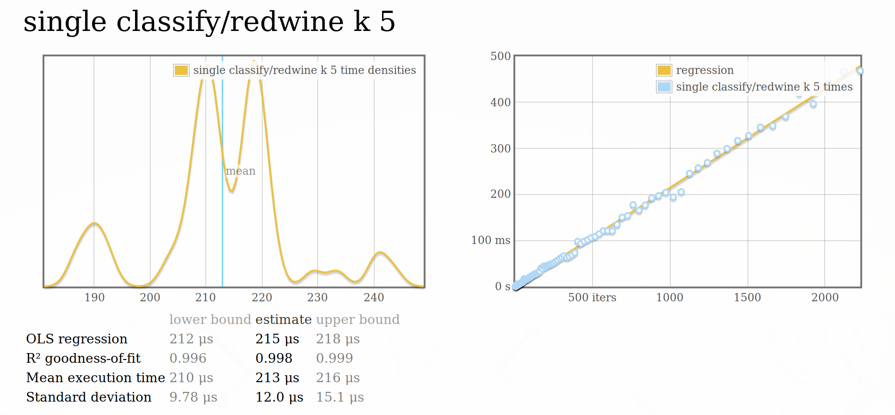
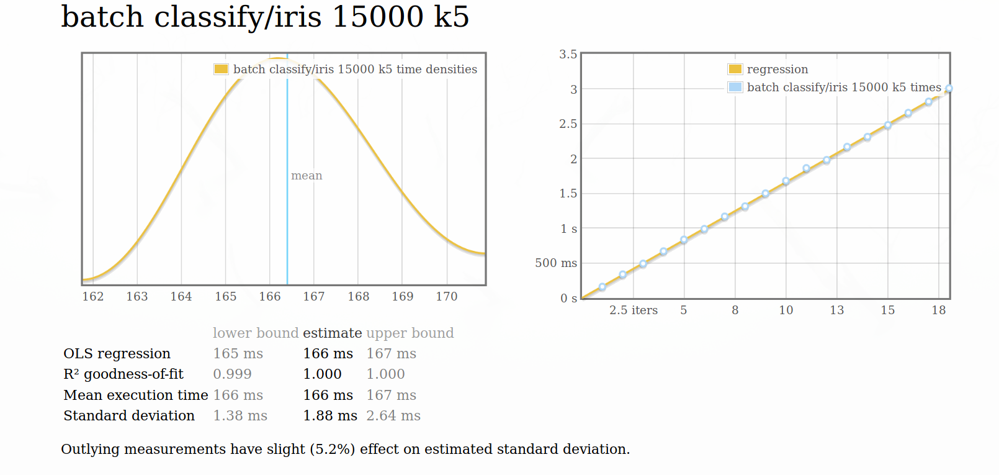
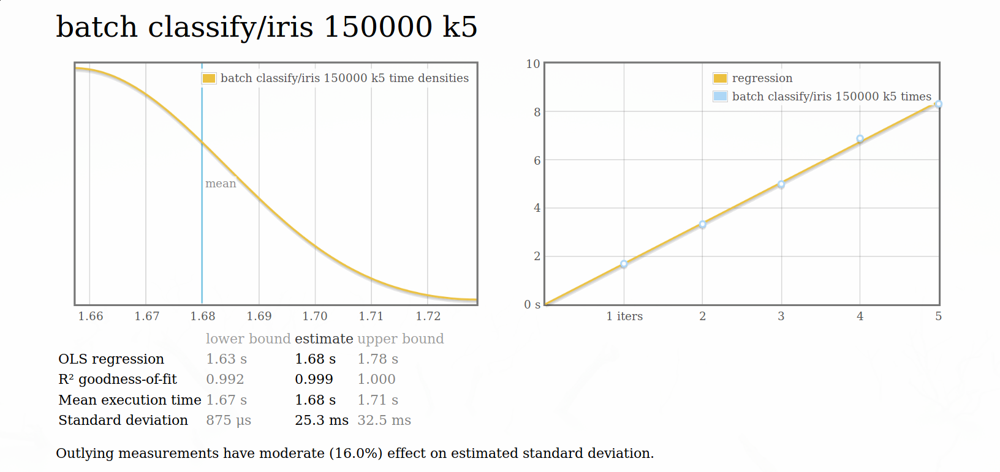
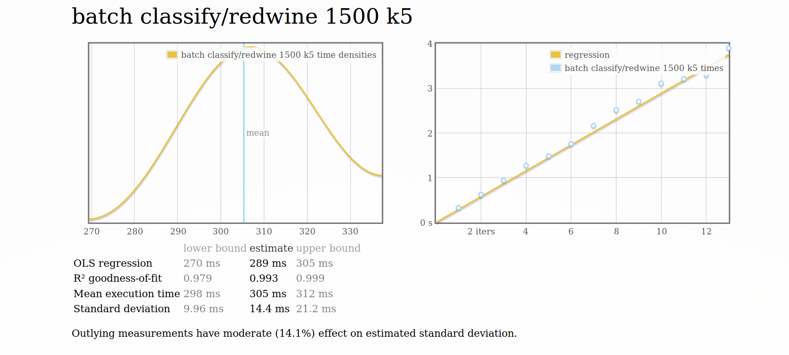
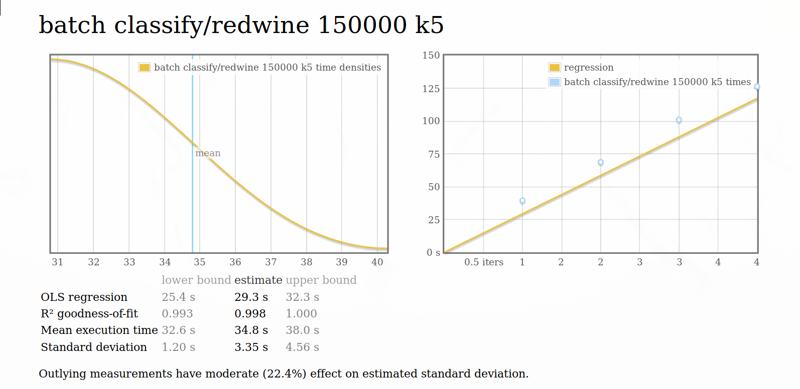

# MLE Übung 2
### Knn Classifier using KFold cross validation

#### Allgemein

Ich habe für diese Übung den Advanced Path mit Zusatzaufgabe gewählt. Nach Absprache mit den Professoren ist es mir 
auch erlaubt worden die Übung in Haskell zu machen. 

Nachdem die Datensätze in verschiedenen Formaten gespeichert sind habe ich sie zuerst zu einem Format geändert und dieses 
für die verwendung der Library vorausgesetzt. (CSV ohne quotation; ',' als seperator und die letzte column ist das label)

Für die Implementation des Knn ist ein KdTree verwendet worden. Dafür habe ich die Haskell Library `kdt` verwendet.

###### Programm verwendung
```shell
    kfold [OPTIONS] [FILE]
      KFolf Knn classification
    
    Common flags:
      -f --folds[=INT]
      -k[=INT]              
      -? --help Display help message

```

### Iris data
Parameter: k=5 folds=10


Die Irisblumen Daten eignen sich hervorragend zum Klassifizieren mittels Knn-Algorithmus.

### Wine data

Im folgenden abschnitt ist immer vom `winequality-red.csv` die Rede.



Wie in der obigen Abbildung zu sehen ist liefert der Knn hier nur ein mässiges Ergebniss.
Dies kann auch darauf zurückzuführen sein, dass es im Datensatz kaum Vertreter der äußeren Klassen gibt und fast alle Daten der Klasse `5` und `6` ensprechen.

Dies kann man deutlicher veranschaulichen, wenn man die Aufgabe leicht ändert und nur mehr Klassifizieren will ob der Wein schlecht(3,4), mittel(5,6) oder gut(7,8) ist.



Hier wird eine Accuracy von über 80% erzeugt, obwohl nur die mittlere Klasse hohe Precision und Recall aufweist.


### Performance

Um die Performance zu testen habe ich die Haskell Microbenchmark Library `criterion` verwendet.
Aufgrund der hohen Lazyness von Haskell Programmen kann es sehr schwer sein Benchmarks zu schreiben, da es nicht nur reicht etwas 
auszurechnen, da der Compiler aggressiv Funktionen und Datenstrukur-teile die nicht verwendet werden gar nicht berechnet.
`Cirterion` vereinfacht dies indem es sich darum kümmert Datenstrukturen vertiefend zu evaluieren und außerdem einen statistische Auswertung 
liefert.
##### Single Classify Benchmark



##### Batch Benchmarks







Weitere benchmark Ergebnisse:

benchmarking single classify/iris k 1
time                 1.802 µs   (1.756 μs .. 1.846 μs)
                     0.995 R²   (0.992 R² .. 0.997 R²)
mean                 1.823 μs   (1.777 μs .. 1.910 μs)
std dev              195.1 ns   (126.4 ns .. 310.5 ns)

benchmarking single classify/iris k 5
time                 8.710 μs   (8.650 μs .. 8.806 μs)
                     0.998 R²   (0.995 R² .. 1.000 R²)
mean                 8.859 μs   (8.733 μs .. 9.203 μs)
std dev              614.9 ns   (251.7 ns .. 1.250 μs)

benchmarking single classify/iris k 10
time                 11.99 μs   (11.89 μs .. 12.11 μs)S
                     0.999 R²   (0.998 R² .. 1.000 R²)
mean                 11.97 μs   (11.88 μs .. 12.14 μs)
std dev              391.1 ns   (274.0 ns .. 573.4 ns)

benchmarking single classify/redwine k 1
time                 3.456 μs   (3.386 μs .. 3.528 μs)
                     0.997 R²   (0.995 R² .. 0.999 R²)
mean                 3.401 μs   (3.350 μs .. 3.472 μs)
std dev              202.8 ns   (143.3 ns .. 263.9 ns)

benchmarking single classify/redwine k 5
time                 210.6 μs   (202.1 μs .. 217.1 μs)
                     0.990 R²   (0.984 R² .. 0.996 R²)
mean                 213.3 μs   (207.4 μs .. 218.2 μs)
std dev              17.22 μs   (13.93 μs .. 21.35 μs)

benchmarking single classify/redwine k 10
time                 267.8 μs   (254.8 μs .. 279.8 μs)
                     0.991 R²   (0.986 R² .. 0.997 R²)
mean                 264.2 μs   (258.2 μs .. 269.7 μs)
std dev              19.47 μs   (16.86 μs .. 22.51 μs)


